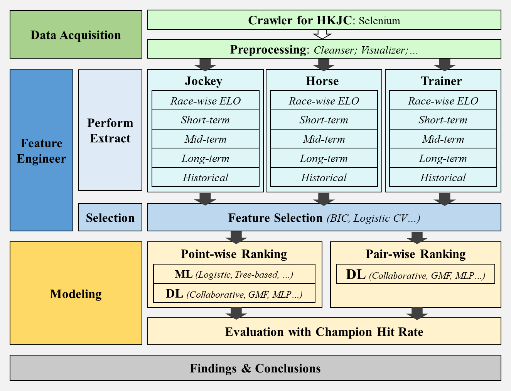

# HKJC Race Ranking

The repo is made for data mining pipeline for HKCJ horse racing champion prediction. 

## 1. Introduction

Hong Kong Jockey Club (HKJC) organizes and regulates horse racing events every week. Predicting the champion of the race has been a problem. However, the previous works only focus on pointwise ranking, and with no all-round pipelines for data mining. 

In this work, we not only scrapped 54436 racing records across 7 years, conducted feature engineering and selection, and built 5 ML models and 4 DL models that follow the traditions, but also innovatively apply pairwise training manner to tackle the problem, and developed python module for horse racing crawling, processing, and champion prediction. Further experiments and analysis proved our assumption is better over traditional ethics.We achieved at most 31.0% and 23.4% champion hit rate in validation and testing set.

## 2. Workflow, File Organizaitons 

### 2.1 Workflow

### 2.2 File Structure for `horse`
horse is the main package developed for HKJC scrapping, processing, prediction, and evaluation, whose structure looks like:

## 3. Crawler

## 4. Organization for Features 

## 5. Modeling

### 5.1 Modeling with Commands

### 5.2 Try Your Own Codes

