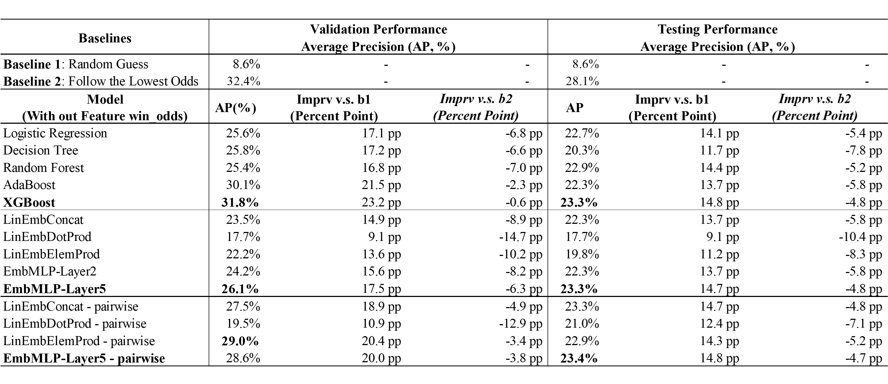
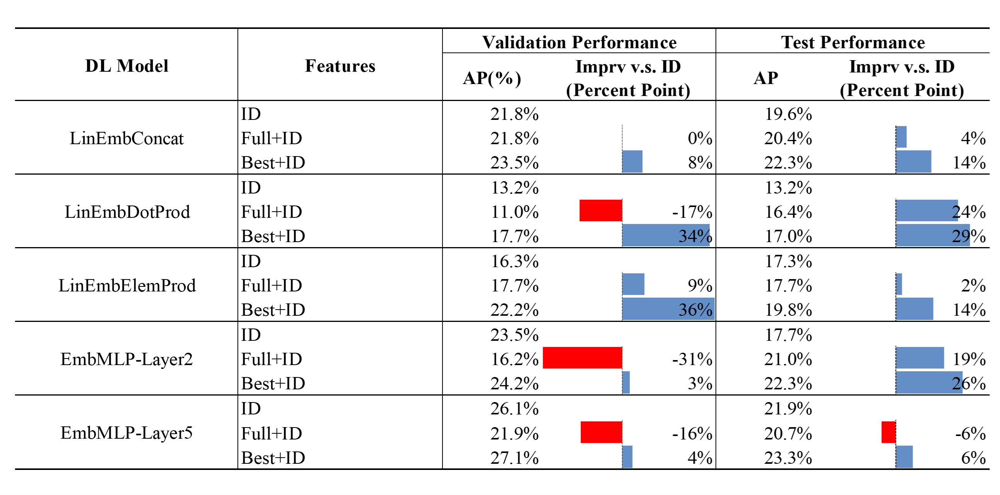
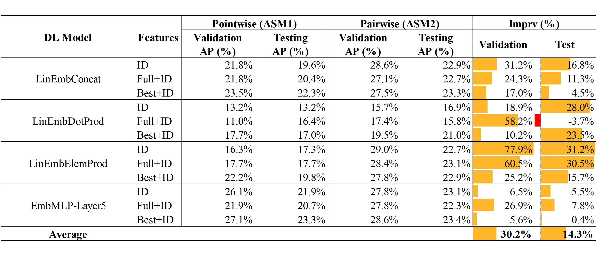

# HKJC Race Ranking

The repo is made for data mining pipeline for HKCJ horse racing champion prediction. 

## 1. Introduction

Hong Kong Jockey Club (HKJC) organizes and regulates horse racing events every week. Predicting the champion of the race has been a problem. However, the previous works only focus on pointwise ranking, and with no all-round pipelines for data mining. 

In this work, we not only scrapped 54436 racing records across 7 years, conducted feature engineering and selection, and built 5 ML models and 4 DL models that follow the traditions, but also innovatively apply pairwise training manner to tackle the problem, and developed python module for horse racing crawling, processing, and champion prediction. Further experiments and analysis proved our assumption is better over traditional ethics.We achieved at most 31.0% and 23.4% champion hit rate in validation and testing set.

For more details, you are welcomed to check our [report](./STAT8017_Who_is_the_champion_HKJC_horse_racing_prediction_report.pdf).

## 2. Workflow, File Organizaitons 

### 2.1 Workflow


### 2.2 Structure for [horse](./horse)
[Horse](./horse) is the main package developed for HKJC scrapping, processing, prediction, and evaluation, whose code base is organized as follows:

The codebase horse is organized as followings.

```
└── horse
    ├── data
    │   └── load_data.py        # Script to load thedata
    ├── model
    │   ├── ml_model.py         # Machine learning models
    │   └── racing_model.py     # Deep models
    ├── scrapper
    │   ├── datetool.py         # tool for race days, HKJC
    │   └── pagetool.py         # tool for pages, HKJC
    ├── process.py              # trivial processing
    ├── train_dl.py             # pointwise training for deep models
    ├── train_pairwise.py       # pairwise training for deep models
    ├── train_ml.py             # pointwise training for ML models
    ├── grid_search_dl.py       # grid search for dl
    └── grid_search.py          # grid search for ml
```

## 3. Crawler
Refer to the processes in [web scrapper](./01_Web_Scrapper.ipynb).

Functions will automatically locate the racing date between some windows required, and craw the records accordingly from HKJC.

## 4. Feature Engineering
### 4.1 Feature Map

**Statistics of each entry, such as horse, jockey, trainer with all-round information, will cover his historical-wide, long-, mid-, and short-term performance**. For example, statistics for each race depending on the time span, wining rate, top4 rate, lifetime, etc, in different granularity in year, month, and days. 

### 4.2 ELO
ELO is a trending way evaluating relative skills among players. We modeled race-level elo, which is based on:


Also, we made course-wise elo for each entity. 

## 5. Modeling
### 5.1 Modeling with Commands
Train Machine Learning Models, for example
``` 
python ./horse/train_ml.py --logistic --C 0.0001
```

Train Deep Models with point-wise manner, for example
``` 
python ./horse/train_dl.py --model_name EmbMLP --k_dim_field 4 --k_dim_id 16 --num_layers 5 --epoch 8 --batch_size 20 --learning_rate 5e-5 --weight_decay 1e-3
```

Tune parameters of pairwise DL models with grid search:
```
python ./horse/grid_search_dl.py --train_file_path ./horse/train_pairwise.py --model_name EmbMLP 
```

### 5.2 Try Your Own Codes
Please firstly load our dataset before further experiments:
``` python
from horse.data.load_data import DataSet

data = DataSet(
    # z-score standarlization for numeric features
    scaling=True                
    # mapping categorical with ix, for emb lookups
    , do_categorization=True    
    # best 22 features, check more in feature selection
    , use_best_feats=True       
)

# cut train, val, test by time with 0.8, 0.1, 0.1 perc
train, val, test = data.my_train_val_test_split([0.8, 0.1, 0.1])
``` 
Then make your own models, or call the ones in our repo [./horse/model/](./horse/model/).


## 6. Metrics, Findings
### 6.1 Performance
Models are required to predict one champion for each game, and will be further evaluated with champion hit rate, or formally, average precision (AP).

The following is the performance across all models compared with two baselines (random, highest winning odds).



We still have a lot to do! Our models so far still cannot beat winning odds without it!

### 6.2 Some Findings
Also, we have some interesting findings along the path. Again, check details in our report, only key ideas would be presented here.

#### 1\) Collaborative Prediction is Powerful Enough
How would models perform with only looking at who is riding on which horse? Such idea originates from recommendation system, and we made experiments over deep models with three sets of data, under pointwise assumptions:
  1. only ID features are passed;
  2. ID + All Numeric Features;
  3. ID + Most Imformative Numeric Features.


- With only IDs for embedding lookups, models are equipped enough predictability if properly trained.

#### 2\) Pairwise Training Outperform the Pointwise one
Besides, the newly proposed pairwise training manner out perform the traditional pointwise a lot regarding nearly all models' AP.


